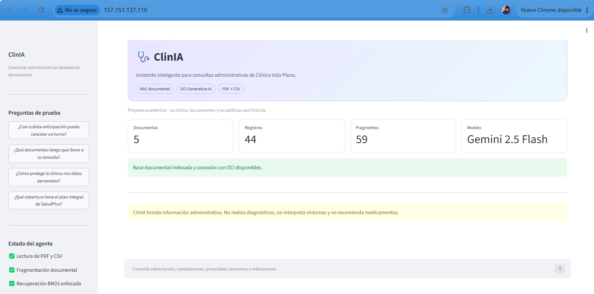

# ClinIA — Asistente Inteligente para Consultorio Médico

ClinIA es un agente académico que responde consultas administrativas usando documentos ficticios de la **Clínica Vida Plena**. Implementa un flujo RAG: carga PDF/CSV, fragmenta el contenido, recupera contexto con BM25 y genera una respuesta fundamentada mediante OCI Generative AI.

## Estado actual

- ✅ Lectura de documentos PDF y CSV.
- ✅ Normalización y conservación de metadatos.
- ✅ Fragmentación de textos con solapamiento.
- ✅ Recuperación local de fragmentos mediante BM25.
- ✅ Integración con OCI Generative AI.
- ✅ Respuestas con fuentes trazables.
- ✅ Bloqueo de diagnósticos y recomendaciones de medicamentos.
- ✅ Deploy público en Oracle Cloud Infrastructure (OCI).
- ✅ 28 pruebas automatizadas aprobadas (`28 passed`).

## Arquitectura

```text
Usuario → Streamlit → Reglas de seguridad → Recuperación BM25
        → Contexto documental → Gemini 2.5 Flash en OCI
        → Respuesta + fuentes
```


## Tecnologías utilizadas

- Python 3
- Streamlit
- Oracle Cloud Infrastructure (OCI)
- OCI Generative AI
- Google Gemini 2.5 Flash
- BM25
- pandas
- pypdf
- pytest
- Nginx
- Ubuntu Linux
- Git y GitHub

## Deploy en OCI

La aplicación fue desplegada en una instancia **Oracle Cloud Infrastructure Compute** utilizando:

- Ubuntu Server
- Streamlit
- Nginx como proxy inverso
- OCI Instance Principal
- OCI Generative AI

### Evidencia

Acceso público mediante IP de OCI:

`http://157.151.137.110`




## Configuración local

1. Crear el entorno e instalar dependencias:

```powershell
.\.venv\Scripts\python.exe -m pip install -r requirements-dev.txt
```

2. Copiar el archivo de variables:

```powershell
Copy-Item .env.example .env
```

3. Verificar que existan las credenciales OCI:

```powershell
Test-Path "$HOME\.oci\config"
Test-Path "$HOME\.oci\oci_api_key.pem"
```

No se deben subir `.env`, archivos `.pem`, OCID personales ni credenciales.

## Probar OCI desde Python

```powershell
.\.venv\Scripts\python.exe scripts\test_oci_connection.py
```

Resultado esperado:

```text
CONEXION OCI DESDE PYTHON OK
Modelo: google.gemini-2.5-flash
```

## Ejecutar la aplicación

```powershell
.\.venv\Scripts\python.exe -m streamlit run app.py
```

Abrir:

```text
http://localhost:8501
```

## Ejecutar pruebas

```powershell
.\.venv\Scripts\python.exe -m pytest
```

## Preguntas de ejemplo

- ¿Con cuánta anticipación puedo cancelar un turno?
- ¿Qué documentos tengo que llevar a la consulta?
- ¿Cómo protege la clínica mis datos personales?
- ¿Qué cobertura tiene el plan Integral de SaludPlus?

## Ejemplo de respuesta

**Pregunta:** ¿Con cuánta anticipación puedo cancelar un turno?

**Respuesta:** La cancelación sin costo debe solicitarse al menos 24 horas antes del horario reservado. La aplicación muestra debajo el documento y la página o fila utilizados como fuente.

## Alcance y seguridad

Todos los datos son ficticios. ClinIA brinda información administrativa. No realiza diagnósticos, no interpreta síntomas y no recomienda medicamentos.

## Mejoras de precisión y experiencia

- Recuperación BM25 con penalización de coincidencias parciales.
- Fuentes incidentales filtradas mediante umbral relativo de relevancia.
- Respuestas completas, breves y sin viñetas cortadas.
- Fuentes ocultas cuando la documentación no contiene una respuesta suficiente.
- Interfaz de chat optimizada para la demostración del Challenge.
